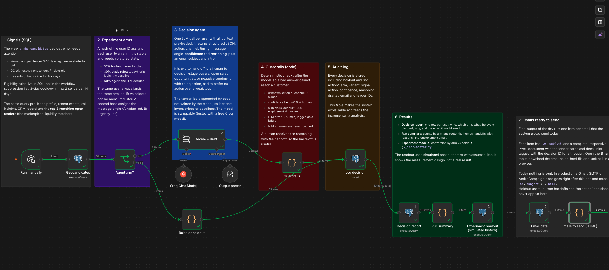
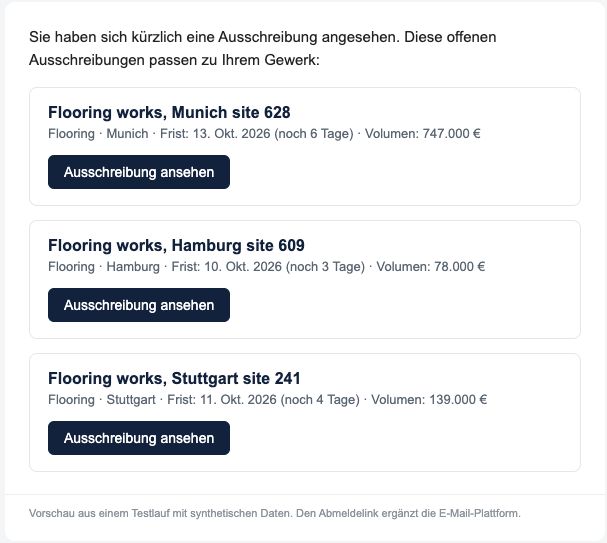
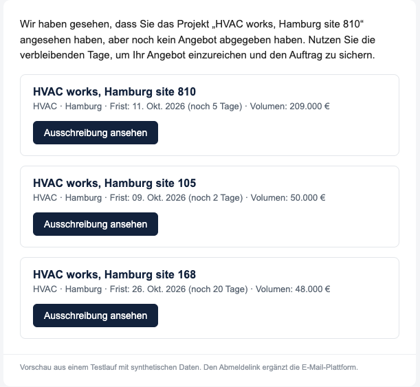
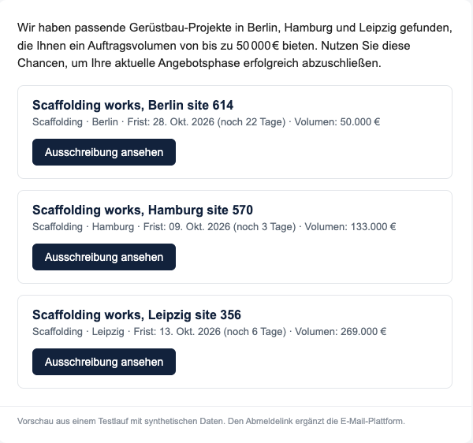

# Next-Best-Action: a signal-driven lifecycle engine

A small, working example of how I would approach lifecycle and retention for a two-sided construction marketplace. Instead of sending everyone the same drip emails, the system looks at what each person actually did, decides what should happen next, writes the message, and keeps the evidence needed to measure whether it made a real difference.

> **All data in this project is made up.** Companies, people, tenders, activity and CRM records are randomly generated, and every email address uses the reserved `.example` domain. The demo results are not results. This is an independent portfolio project, not affiliated with and not built on data from any company.



*The whole system as one n8n workflow. Each stage has a note on the canvas that explains what it does.*

---

## The idea in one minute

A marketplace has two sides to move.

- **Subcontractors** need to discover tenders, place a first bid, convert to a paid plan, and keep bidding.
- **General contractors (GCs)** need to post a first tender, then a second and a third.

A fixed email sequence cannot tell apart a subcontractor who looked at a tender and got distracted from one who has been silent for three weeks, or a GC who posted one tender and left. Their next step is different, so the message and the timing should be too.

Each time the workflow runs, it:

1. **Finds who needs attention** using behavioural signals (see below).
2. **Assigns each person to a group** so the effect can be measured later.
3. **Decides the next best action** for each person: email, in-app message, human follow-up, or nothing.
4. **Checks the decision** against safety rules before anything could reach a customer.
5. **Writes the email**, with the open tenders that best match that subcontractor.
6. **Logs every decision with its reasoning**, so it can be audited and analysed.
7. **Shows the result**: a report, a summary, and the finished HTML emails.

**It is a dry run.** Nothing is sent. The point is to show the decision logic and the output end to end.

## What the emails look like

These three were produced by the workflow from the made-up data. The tender cards come straight from the database and are placed by code, not written by the AI.

<table>
<tr>
<td width="33%"></td>
<td width="33%"></td>
<td width="33%"></td>
</tr>
<tr>
<td><b>1. Baseline.</b> A fixed rule: everyone with this signal gets the same sentence.</td>
<td><b>2. AI-written.</b> Refers to the specific tender this person looked at but did not bid on.</td>
<td><b>3. AI-written.</b> Frames the open tenders in their trade across the regions they work in.</td>
</tr>
</table>

**One honest observation.** In the third email the AI wrote "up to €50,000", but the cards below it range from €50,000 to €269,000. The cards are correct because the database produces them. The sentence is wrong because the model wrote it. A fact-check on AI-written sentences is the first thing I would add before sending anything to a real customer.

## How it decides, in plain language

**The signals.** Three situations trigger attention:

- A subcontractor viewed a tender that is still open 3 to 10 days ago and never started a bid.
- A GC posted exactly one tender, more than a week ago, and never a second.
- A free-plan subcontractor has been inactive for two weeks or more.

Eligibility rules are enforced in the database, so they can't be skipped by a workflow mistake: people on the suppression list are excluded, nobody is contacted twice within 3 days, and nobody gets more than 2 messages in 14 days.

**Matching people to tenders.** For each subcontractor, the system ranks open tenders by trade (must match), region, how soon the deadline is, and how often they have bid in that trade before. The top three go into the email. This is the part that works on **marketplace liquidity**: getting the right subcontractors in front of the right tenders, not just sending messages.

**The AI decision.** For each person, one AI call receives their profile, recent activity, any call notes, their CRM record and their best-matching tenders. It must answer in a fixed structure: what to do, on which channel, when, with what message angle, how confident it is, and why. It is told to prefer doing nothing over sending a weak message, and to hand over to a person when the situation calls for it.

**Handing over to a human.** Some cases are better handled by a person than by automation. The workflow routes to a human when:

- the AI is not confident enough (below 60%),
- the account is large (200+ employees),
- the AI itself recommends a human touch, for example for a buyer in the decision stage,
- the AI call fails, or its answer is invalid.

The human receives the reasoning, so the handover is useful rather than a data dump.

## How I would know it works

The goal is **incremental impact, not campaign output**: not "how many emails were sent" but "how many extra people converted because of them".

Everyone is assigned to one of three groups by a calculation on their user ID, so the same person is always in the same group:

| Group | Share | What happens |
|---|---|---|
| **Holdout** | 10% | Never contacted. This is the reference for what happens anyway. |
| **Static rules** | 30% | A fixed message per signal, like a classic drip journey. The baseline to beat. |
| **AI decision** | 60% | The decision engine described above. |

Comparing conversion (a bid submitted, or a paid conversion, within 7 days) across the three groups shows the real lift of the rules and of the AI over doing nothing, and whether the AI beats the simple rules enough to justify its extra complexity. A second, independent split tests two message angles: value-led and urgency-led.

**The numbers in the demo are invented.** The sample data includes made-up past outcomes with assumed lifts (roughly +4 points for rules, +8 to +9 for the AI) so that the reporting step has something to display. They show that the measurement works, not that the AI works.

## How this maps to the work

| What the role involves | Where to see it here |
|---|---|
| Lifecycle journeys for both sides of a marketplace | Three signals, one set per lifecycle stage, for subcontractors and GCs |
| Moving from static journeys to systems that decide what happens next | Per-person decision with action, channel, timing, message angle, confidence and reasoning |
| Experiments and holdouts, judged on incremental impact | 10% holdout, rules baseline, deterministic assignment, incrementality report |
| Handing off to Sales and Customer Success when a human is better | Confidence, account size and explicit-handoff rules, with the reasoning passed along |
| CRM as a lever for marketplace liquidity | Tender matching feeds the email content |
| Building a repeatable system rather than one-off campaigns | Same logic for every user, logged and measurable, runs on a schedule |

## Honest limits

- **Synthetic data only.** No real customer behaviour has gone through this.
- **Small batches.** A run processes a small batch (10 people by default) because I tested with a free AI model that rate-limits. About 570 people were eligible in the sample, so the engine would work through them over repeated runs. Counts in one run say how the pipeline behaves, not how well it performs.
- **One free model tested.** I tested with a free model (Groq, `llama-3.3-70b-versatile`). A stronger model would likely judge handovers better. The model can be swapped without changing anything else.
- **AI-written text needs checking.** See the €50,000 example above.
- **Nothing is sent.** There are no integrations with an email platform or a CRM in the version I ran.
- **The extended design is a blueprint.** `workflows/extended/` also contains a larger design with Slack alerts, a CRM task and ActiveCampaign sync. I ran only the simple workflow end to end.
- **The statistics are basic.** There is no confidence interval on the lift and no power calculation yet.

## What I would do next with real data

1. Replace the made-up tables with real product events, CRM state and enrichment, keeping the same candidate list as the single contract.
2. Do a power calculation before launch, so the 10% holdout is large enough to detect a realistic lift. Add a check that the groups were assigned as intended, and confidence intervals on the results.
3. Check consent and the legal basis per channel (GDPR, and German rules on marketing emails) before any send, and keep the suppression list in sync with the email platform's unsubscribes.
4. Add a fact-check on AI-written copy, then review a sample of decisions by hand each week.
5. Add error handling, retries and duplicate protection on the send step, and connect the human handover to a real CRM task and Slack alert.
6. Extend to the other journeys: onboarding, referral after a won bid, and winback.

---

## For the technical reader: run it yourself

<details>
<summary><b>Quick start</b></summary>

You need Docker. A SQL client such as DBeaver is optional but makes it easier.

**1. Start the database** (on `localhost:5433`, so it does not clash with a Postgres already using 5432):

```bash
docker compose up -d postgres
```

**2. Load the made-up data.** Either use a SQL client (no Python needed):

- Connect to host `localhost`, port `5433`, database `nba`, user `postgres`, password `postgres`.
- Run these files in order: `sql/01_schema.sql`, `sql/02_digest_tender_builder.sql`, `sql/03_seed_data.sql`, and optionally `sql/04_simulate_history.sql` (the invented past outcomes).

Or use Python:

```bash
pip install -r requirements.txt
python scripts/seed_data.py --init --reset --simulate-history
```

The SQL data file uses timestamps relative to now, so the signals always fire. The CSVs in `data/` have fixed dates and stop producing candidates after about a week.

**3. Run the workflow** in any [n8n](https://n8n.io) (`docker compose up -d` also starts one at http://localhost:5678):

1. Import `workflows/nba_simple.json`.
2. Create a Postgres credential. Use host `postgres`, port `5432` if n8n runs from this `docker-compose.yml`; host `host.docker.internal`, port `5433` if n8n runs in a different Docker setup; host `localhost`, port `5433` if n8n runs directly on your machine. Database `nba`, user and password `postgres`.
3. Add credentials for a chat model. The workflow uses Anthropic Claude by default, and any chat model node works.
4. Click **Execute workflow**, then open the last nodes to see the report, the summary and the emails. Each email item also has a downloadable `.html` file under **Binary**.

Free model tiers rate-limit. If calls fail, lower the `LIMIT` in the *Get candidates* node. To start a run again from scratch, run `DELETE FROM decisions WHERE workflow_version = 'nba-simple-v1';` (people are skipped for 3 days after a decision).

Check results in SQL:

```sql
SELECT * FROM v_nba_candidates LIMIT 10;                    -- who is eligible, and why
SELECT * FROM decisions ORDER BY decided_at DESC LIMIT 20;  -- audit trail with reasoning
SELECT * FROM v_incrementality;                             -- conversion by group vs holdout
```

</details>

<details>
<summary><b>Repo layout</b></summary>

```
assets/                              screenshots and example emails used in this README
sql/01_schema.sql                    tables, group assignment, tender matching, signal and incrementality views
sql/02_digest_tender_builder.sql     tables and views for tender-email performance
sql/03_seed_data.sql                 made-up data as plain INSERTs
sql/04_simulate_history.sql          optional: invented past outcomes with assumed lifts
scripts/seed_data.py                 data generator that writes straight to Postgres
scripts/export_data.py               regenerates sql/03_seed_data.sql and data/*.csv
data/*.csv                           the same data as CSV (fixed dates)
workflows/nba_simple.json            the workflow I ran end to end (25 nodes including notes)
workflows/extended/                  larger blueprint: AI agent with tools, Slack, CRM task, ActiveCampaign (not run)
docs/digest_preview.html             static sample of the extended design's email
docker-compose.yml                   Postgres 16 and n8n
```

</details>

<details>
<summary><b>Technical notes</b></summary>

- **Group assignment** is a hash of the user ID, so it needs no stored state and is reproducible in SQL or JavaScript:

  ```sql
  SELECT CASE WHEN b < 10 THEN 'holdout' WHEN b < 40 THEN 'rules' ELSE 'agent' END
  FROM (SELECT (hashtextextended(uid::text, 0) & 2147483647) % 100 AS b) s;
  ```
- **Tender matching** is the SQL function `match_tenders()`: trade is a hard filter, then region, deadline urgency and past bidding add to the score. It skips tenders already bid on or closing within a day.
- **Guardrails in code** run after the model: an invalid action or channel, a confidence below 0.6, a high-value account, or an LLM error all route to a human. Holdout users are never touched.
- **The model returns structured JSON**, and the tender list and HTML are rendered by code, so the model cannot invent prices or deadlines in the cards.
- **Incrementality** is the view `v_incrementality`: first decision per user, conversion within 7 days, lift against the holdout.

</details>

## License

MIT
